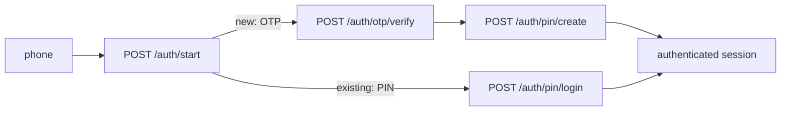

# Authentication

## Route visibility

| Route | Public | Patient token | Installation ID |
|---|---:|---:|---:|
| `/auth/start`, OTP, PIN login/create/recovery, `/auth/refresh` | yes | no | no |
| `/auth/pin/change-required`, `/auth/sessions`, `/auth/logout`, `/auth/logout-all` | no | required | no |
| Notification routes | optional auth | valid Patient Mobile token if supplied | required only when no token |
| Public catalogs | yes | no | no |
| All other Mobile routes, including uploads | no | required | no |

Mobile access tokens have audience `mobile`; dashboard tokens fail with `401`. A missing credential is guest only for notifications. A supplied invalid/expired/revoked credential returns `401` and never downgrades to guest.

## Start and login

```bash
curl -X POST '{{baseUrl}}/mobile/auth/start' -H 'Content-Type: application/json' \
  -d '{"phone":"07700000000"}'
```

Existing number:

```json
{ "error": false, "message": "تم بدء المصادقة بنجاح", "data": { "flowId": "opaque-flow-id-at-least-20-chars", "nextStep": "PIN" } }
```

New number returns `nextStep: "OTP"`, `expiresAt`, and optionally `debugOtp`. The response deliberately does not expose `accountExists`.



```json
{ "flowId": "opaque-flow-id-at-least-20-chars", "pin": "123456", "deviceId": "install-uuid", "deviceName": "Pixel", "platform": "android" }
```

PIN and OTP are exactly six digits. The auth flow lasts 10 minutes; an OTP lasts 5 minutes. Each flow permits 5 OTP attempts, 3 resends, and 5 PIN attempts. Resend cooldown is 45 seconds. `debugOtp` appears only when `NODE_ENV` is not `production` and `OTP_DEBUG_RETURN_CODE=true`; production uses the configured OTP delivery webhook and never returns the code.

New registration calls `/otp/verify` then `/pin/create`. Existing login calls `/pin/login`. PIN recovery calls `/pin/forgot/start`, `/pin/forgot/resend`, `/pin/forgot/verify`, then `/pin/forgot/reset` with matching `pin` and `confirmPin`. Recovery reset revokes all old sessions and returns a new unrestricted session.

Successful login/create/reset data:

```json
{ "accessToken": "<jwt>", "refreshToken": "<jwt>", "mustChangePin": false, "sessionId": "uuid" }
```

Access tokens keep their configured short lifetime (currently 24 hours). Patient sessions have no fixed time-based expiry and remain active until logout, logout-all, device-limit eviction, account/security invalidation, PIN recovery, or refresh-reuse protection revokes them. Mobile refresh JWTs therefore have no `exp`; Redis remains authoritative and refresh tokens are still rotating and single-use. A Patient may have 5 sessions; creating a sixth evicts the oldest. `/auth/sessions` returns safe device/session metadata plus `current`, `persistent: true`, and `expiresAt: null`.

## Refresh, reuse, logout

```bash
curl -X POST '{{baseUrl}}/mobile/auth/refresh' -H 'Content-Type: application/json' \
  -d '{"refreshToken":"{{refreshToken}}"}'
```

Refresh tokens rotate. Store the newly returned access and refresh tokens atomically. Reusing a consumed refresh token returns `AUTH_REFRESH_REUSED` and revokes that session. This remains true after the bounded 30-day used-token audit marker expires: while the session exists, Redis compares the submitted digest with the session's authoritative current digest and treats a mismatch as replay. A token from an already logged-out/revoked session returns `AUTH_SESSION_REVOKED`. `/logout` revokes the current session; `/logout-all` revokes all sessions. Do not implement a client-side 30-day (or inactivity-based) logout timer.

Redis persistence is part of the deployment contract: production uses append-only persistence (`appendonly yes`) and `noeviction`. If Redis loses its session dataset, the server fails closed and does not reconstruct a session from a signed refresh JWT. Mobile users whose Redis session state is lost must authenticate again. Rotating `REFRESH_TOKEN_SECRET` also invalidates all existing refresh JWTs because the service currently verifies with one active secret and has no current/previous-key overlap.

```text
request -> attach access token
401 -> if request was not refresh/retried: refresh once
refresh success -> atomically save both tokens -> retry original once
terminal refresh failure (`AUTH_SESSION_REVOKED`, `AUTH_REFRESH_INVALID`, `AUTH_REFRESH_REUSED`, or invalid account state) -> clear credentials -> show login/PIN
```

Never refresh on `403`. Avoid simultaneous refresh races by single-flighting refresh requests.

Client security recommendation: store tokens in iOS Keychain or Android Keystore/encrypted secure storage. Never store refresh tokens in plain SharedPreferences or local storage.

## Forced PIN change

An admin reset can set `mustChangePin: true`. Restricted sessions may call only `/auth/pin/change-required`, `/auth/logout`, and `/auth/logout-all`; other protected and authenticated notification calls return `403`. Submit `{ "pin": "654321" }` to change the PIN. The service revokes other sessions and returns replacement tokens for the current session.

Arabic: عند ظهور `mustChangePin` افتح شاشة تغيير الرمز فوراً، ولا تحاول تحديث التوكن عند خطأ `403`.

## Auth rate limits

Fixed Redis windows: start per phone `5/10m`, per IP `30/10m`; resend per phone `6/10m`, per IP `30/10m`; verify per phone `20/10m`, per IP `60/10m`; PIN per phone `5/10m`, per IP `30/10m`. Flow-local attempt/cooldown limits still apply. A rate response can include HTTP `Retry-After` and `retryAfterSeconds`; disable the control until it expires.

Common codes: `AUTH_PHONE_INVALID`, `AUTH_FLOW_INVALID`, `AUTH_FLOW_EXPIRED`, `AUTH_OTP_INVALID`, `AUTH_OTP_EXPIRED`, `AUTH_OTP_ATTEMPTS_EXCEEDED`, `AUTH_OTP_RESEND_COOLDOWN`, `AUTH_OTP_RESEND_LIMIT`, `AUTH_PIN_INVALID`, `AUTH_PIN_ATTEMPTS_EXCEEDED`, `AUTH_REFRESH_INVALID`, `AUTH_REFRESH_REUSED`, `AUTH_SESSION_REVOKED`, `AUTH_WRONG_AUDIENCE`, `OTP_PROVIDER_FAILURE`, `SESSION_STORE_UNAVAILABLE`.
