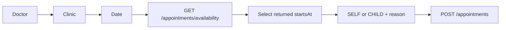
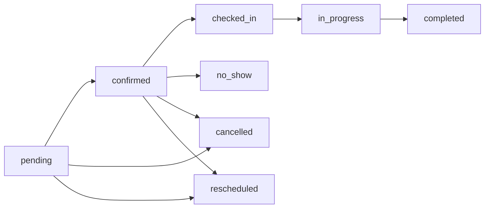
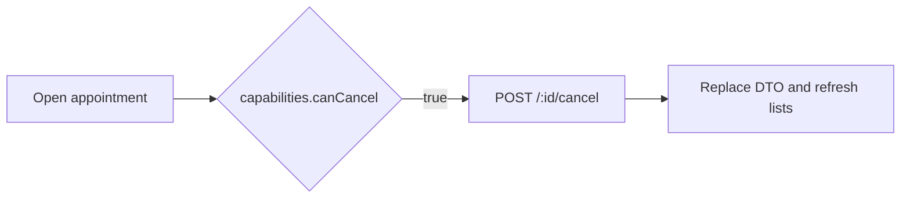
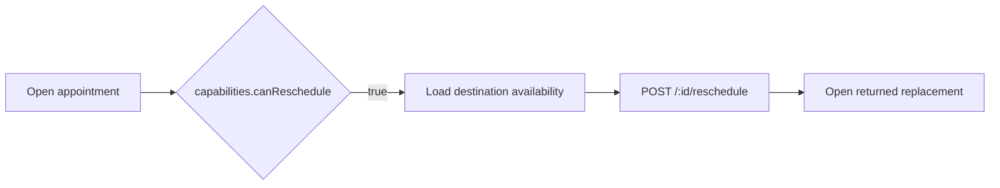

# Appointments

All seven routes require a Patient Mobile token.

| Method and path | Input | Success |
|---|---|---|
| `GET /appointments/availability` | required `doctorId`, `clinicId`, `date`; optional `specialtyId` | `200` slots |
| `GET /appointments` | `page`, `limit` (max 100), `status`, `view=upcoming|past|cancelled` | `200` page |
| `POST /appointments` | booking body | `201` |
| `GET /appointments/:id` | owned ID | `200` |
| `GET /appointments/:id/history` | owned ID | `200` chronological history |
| `POST /appointments/:id/cancel` | nullable optional `reason` | `200` |
| `POST /appointments/:id/reschedule` | destination body | `200` replacement appointment |

## Booking



Availability status values are `AVAILABLE`, `DAILY_CAP_REACHED`, `FULLY_BOOKED`, `DOCTOR_CLOSED`, `NO_WORKING_HOURS`, `NO_VALID_SLOT`, and `NO_UPCOMING_AVAILABILITY`. Response includes `dailyCapacity` (`max`, `booked`, `remaining`, `reached`, `availableSlotCount`, `bookableRemaining`), `slots`, `nextAvailable`, and up to three `nextAvailableOptions` searched over the next 30 days. Send the exact ISO `startsAt` returned by the server.

SELF:

```json
{"doctorId":"66f000000000000000000030","clinicId":"66f000000000000000000020","specialtyId":"66f000000000000000000010","date":"2026-09-08","startsAt":"2026-09-08T07:30:00.000Z","beneficiary":{"type":"SELF"},"reason":"متابعة دورية"}
```

CHILD replaces beneficiary with `{"type":"CHILD","childId":"66f000000000000000000040"}`. The child must be active and owned.

```bash
curl -X POST '{{baseUrl}}/mobile/appointments' -H 'Authorization: Bearer {{accessToken}}' -H 'Content-Type: application/json' -d '{"doctorId":"{{doctorId}}","clinicId":"{{clinicId}}","date":"2026-09-08","startsAt":"2026-09-08T07:30:00.000Z","beneficiary":{"type":"SELF"}}'
```

Created/detail DTO uses camelCase: `_id`, `appointmentNumber`, `patientId`, `beneficiaryType`, nullable `childId`, `doctorId`, `clinicId`, nullable `specialtyId`, `startsAt`, `endsAt`, `localDate`, `localStartsAt`, `localEndsAt`, `timezone`, `status`, `bookingSource`, nullable `reason`, snapshot `doctor`, `clinic`, nullable `specialty`, `beneficiary`, `pricing`, `paymentStatus`, reschedule links, nullable cancellation, `capabilities`, and timestamps. Snapshot names/pricing remain stable even if source records later change.

## Patient state matrix

| Value | English / العربية | UI | Patient action |
|---|---|---|---|
| `pending` | Awaiting confirmation / بانتظار التأكيد | Pending badge | cancel/reschedule only when capability true |
| `confirmed` | Accepted and active / مؤكد وفعال | Show time and reminder | cancel/reschedule only when capability true |
| `checked_in` | Arrived/check-in recorded / تم تسجيل الوصول | Checked in | none |
| `in_progress` | Visit in progress / الزيارة جارية | In progress | none |
| `completed` | Visit completed / اكتملت الزيارة | Past/completed | none |
| `no_show` | Patient did not attend / لم يحضر المريض | Past/no-show | none |
| `cancelled` | Cancelled / ملغى | Show cancellation | none |
| `rescheduled` | Replaced by another appointment / أعيدت الجدولة | Link `rescheduledTo` | open replacement |

Suggested labels are exactly the English/Arabic phrases above and belong in Mobile, not the backend.



## Cancel and reschedule





Patient cancel/reschedule is allowed only from `pending` or `confirmed` and outside that Doctor's `cancellation_window_hours`. Reschedule additionally requires Doctor `allow_reschedule`. Use returned `capabilities.canCancel/canReschedule`, but handle a later `409` because time/state can race.

Meaningful codes: `APPOINTMENT_INVALID`, `APPOINTMENT_TIME_INVALID`, `APPOINTMENT_NOT_FOUND`, `APPOINTMENT_NOT_OWNED`, `APPOINTMENT_BENEFICIARY_INVALID`, `DOCTOR_NOT_BOOKABLE`, `DOCTOR_NOT_AT_CLINIC`, `SPECIALTY_INVALID`, `APPOINTMENT_TOO_SOON`, `APPOINTMENT_DAILY_CAP_REACHED`, `APPOINTMENT_SLOT_UNAVAILABLE`, `APPOINTMENT_INVALID_TRANSITION`, `APPOINTMENT_CANCELLATION_WINDOW_CLOSED`, `APPOINTMENT_RESCHEDULE_NOT_ALLOWED`. Slot conflicts can include `nextAvailable` and `nextAvailableOptions` at top level.

Confirmed appointments schedule 24-hour and 2-hour reminders. A reminder whose time has already passed is not created. Cancellation, completion, no-show, and rescheduling cancel still-undelivered future reminders; the replacement schedules its own reminders if confirmed.

Arabic: الخادم هو المرجع الوحيد لصحة الوقت والسعة؛ عند `409` أعد تحميل الأوقات ولا تعِد الإرسال تلقائياً.

