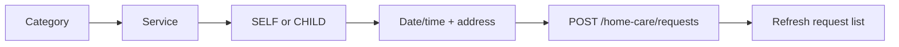

# Home Care

Catalog routes are public; request routes require a Patient Mobile token.

## Catalog

- `GET /mobile/home-care/categories` returns an ordered array of `{_id,name,description,icon,image}`.
- `GET /mobile/home-care/services?categoryId=...` returns `{_id,category_id,name,short_description,description,image,duration_min,duration_max,price}`.
- `GET /mobile/home-care/services/:id` returns one active service.

Only active records are returned, ordered by server `display_order` then `_id`. The Mobile DTO omits status/display order. Price is an integer (demo/current currency context is IQD); duration bounds are nullable minutes. Catalog cache TTL is 300 seconds.

```bash
curl '{{baseUrl}}/mobile/home-care/services?categoryId=66f000000000000000000050'
```

## Request creation

`POST /mobile/home-care/requests` accepts:

```json
{"service_id":"66f000000000000000000051","child_id":null,"requested_date":"2026-09-08","preferred_time":"10:30","address":{"address_text":"بغداد - المنصور","lat":33.3128,"lng":44.3615},"notes":"يرجى الاتصال قبل الوصول"}
```

Omit/null `child_id` for SELF; provide an active owned child for CHILD. The server snapshots service name, price, and duration. Patient must not send request number, category, status, dispatch, nurse, or snapshot fields. Requested date cannot be before the current Baghdad date; there is no additional same-day lead-time rule in current code.



`GET /requests` supports `page`, `limit` max 100, and `status`; detail is `GET /requests/:id`; cancel is `PATCH /requests/:id/cancel` with optional nullable reason. Mobile response contains service snapshot, beneficiary, requested date/time/address, notes, status, nullable `assigned_nurse` (`_id`, `full_name`, nullable `profile_photo`, `license_verified`), nullable cancellation, and timestamps. Internal dispatch metadata is not returned.

## State matrix

| Value | Meaning / المعنى | Controlled by | Patient cancel |
|---|---|---|---|
| `pending` | Awaiting review / بانتظار المراجعة | system/admin | yes |
| `confirmed` | Accepted, awaiting/available for assignment / مؤكد | admin | yes |
| `assigned` | Nurse assigned / تم تعيين الممرض | nurse/admin | no |
| `on_the_way` | Nurse travelling / الممرض في الطريق | nurse | no |
| `arrived` | Nurse arrived / وصل الممرض | nurse | no |
| `in_progress` | Service in progress / الخدمة جارية | nurse | no |
| `completed` | Completed / مكتمل | nurse | no |
| `cancelled` | Cancelled / ملغى | patient/admin | no |
| `rejected` | Rejected / مرفوض | admin | no |

Suggested UI labels follow the meaning column. Patient cancellation is implemented only for `pending` and `confirmed`; a race returns `409`.

Common failures: malformed service/child/request ID `400`; unavailable service or inactive child `422`; another Patient's child/request `404`; cancellation from current state `409`. Most Home Care DomainErrors currently omit stable `code`, so branch primarily on HTTP status and refetch on `409`.

Images for categories/services and nurse photo are nullable; use neutral placeholders. Arabic: لا تعرض خطأ عند قائمة فارغة، واعرض حالة فارغة مع زر تحديث/إنشاء طلب.

