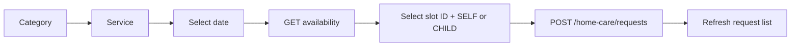

# Home Care

Catalog routes are public; request routes require a Patient Mobile token.

## Catalog

- `GET /mobile/home-care/categories` returns an ordered array of `{_id,name,description,icon,image}`.
- `GET /mobile/home-care/services?categoryId=...` returns `{_id,category_id,name,short_description,description,image,duration_min,duration_max,price}`.
- `GET /mobile/home-care/services/:id` returns one active service.
- `GET /mobile/home-care/services/:id/availability?date=YYYY-MM-DD` resolves the date to its `Asia/Baghdad` weekday and returns only that weekday's active service slots.

Only active records are returned, ordered by server `display_order` then `_id`. The Mobile DTO omits status/display order. Price is an integer (demo/current currency context is IQD); duration bounds are nullable minutes. Catalog cache TTL is 300 seconds. Availability is intentionally uncached because today's result changes with the current time and 30-minute lead window.

```bash
curl '{{baseUrl}}/mobile/home-care/services?categoryId=66f000000000000000000050'
```

## Request creation

After choosing a service and date, fetch availability, render each canonical `time`, retain the selected slot `_id`, then submit with a required UUID v4 header generated once for this logical request:

```http
Idempotency-Key: 550e8400-e29b-41d4-a716-446655440000
```

```json
{"service_id":"66f000000000000000000051","availability_slot_id":"66f000000000000000000052","child_id":null,"requested_date":"2026-09-08","address":{"address_text":"بغداد - المنصور","lat":33.3128,"lng":44.3615},"notes":"يرجى الاتصال قبل الوصول"}
```

Do not submit `preferred_time`. The backend resolves an ACTIVE slot belonging to the selected service and the Baghdad weekday represented by `requested_date`, then snapshots its immutable time identity into `preferred_time`. It rechecks weekday, time, slot ownership/status, and active service/category state inside the request transaction. A stale slot or a slot selected for another weekday is rejected with `HOME_CARE_SLOT_NOT_AVAILABLE_FOR_DATE`.

When the patient changes the selected date, clear the previously selected `availability_slot_id`, refetch availability for the new date, and require a new selection. Never reuse a slot ID across a date change.

Persist the key beside the pending form before sending. Reuse the exact key and semantically identical payload after a timeout, connection loss, app restart, or other uncertain response. The first successful create returns `201`; a matching replay within 24 hours returns the original request with `200` and `Idempotent-Replay: true`. Do not create a fresh key merely because the response was lost. Reusing a key with a different normalized payload returns `409`; generate a new key only for a genuinely new submission. Keys are scoped to the authenticated Patient and expire after 24 hours.

Flutter example using the `uuid` package:

```dart
final key = draft.idempotencyKey ?? const Uuid().v4();
await drafts.save(draft.copyWith(idempotencyKey: key));

final response = await dio.post(
  '/mobile/home-care/requests',
  data: draft.toJson(),
  options: Options(headers: {'Idempotency-Key': key}),
);

// Keep the same key while retrying an uncertain result. Clear the draft only
// after either 201 or 200 has returned a valid request DTO.
```

Omit/null `child_id` for SELF; provide an active owned child for CHILD. The server also snapshots service name, price, and duration. Requested dates use `Asia/Baghdad` and cannot be in the past. The backend derives the weekday; clients do not send it. For today, a slot is usable only when it is at least 30 minutes ahead, and exactly 30 minutes is allowed. Future dates return all ACTIVE slots only for the weekday represented by the requested date. A weekday with no active slots returns `slots: []`. Inactive services or categories expose no availability.



`GET /requests` supports `page`, `limit` max 100, and `status`; detail is `GET /requests/:id`; cancel is `PATCH /requests/:id/cancel` with optional nullable reason. Mobile response contains nullable `availability_slot_id` (null only for legacy rows) and immutable `preferred_time`, plus the existing service snapshot, beneficiary, requested date/address, notes, status, nurse, cancellation, and timestamps. Internal dispatch metadata is not returned.

## State matrix

| Value | Meaning / المعنى | Controlled by | Patient cancel |
|---|---|---|---|
| `pending` | Awaiting review / بانتظار المراجعة | system/admin | yes |
| `confirmed` | Accepted, awaiting/available for assignment / مؤكد | admin | yes |
| `assigned` | Nurse assigned / تم تعيين الممرض | nurse/admin | no |
| `on_the_way` | Nurse travelling / الممرض في الطريق | nurse | no |
| `arrived` | Nurse arrived / وصل الممرض | nurse | no |
| `in_progress` | Service in progress / الخدمة جارية | nurse | no |
| `completed` | Completed / مكتمل | nurse | no |
| `cancelled` | Cancelled / ملغى | patient/admin | no |
| `rejected` | Rejected / مرفوض | admin | no |

Suggested UI labels follow the meaning column. Patient cancellation is implemented only for `pending` and `confirmed`; a race returns `409`.

Common failures: missing/malformed `Idempotency-Key` `400/422`; same key with a different payload `409`; malformed service/slot/child/request ID `400`; missing or hidden service `404`; inactive/foreign/edited/wrong-weekday slot `409` with `HOME_CARE_SLOT_NOT_AVAILABLE_FOR_DATE`; past date or lead-time violation `422`; another Patient's child/request `404`; cancellation from current state `409`.

Images for categories/services and nurse photo are nullable; use neutral placeholders. Arabic: لا تعرض خطأ عند قائمة فارغة، واعرض حالة فارغة مع زر تحديث/إنشاء طلب.
