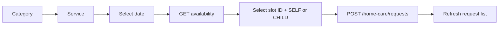

# Home Care

Catalog routes are public; request routes require a Patient Mobile token.

## Catalog

- `GET /mobile/home-care/categories` returns an ordered array of `{_id,name,description,icon,image}`.
- `GET /mobile/home-care/services?categoryId=...` returns `{_id,category_id,name,short_description,description,image,duration_min,duration_max,price}`.
- `GET /mobile/home-care/services/:id` returns one active service.
- `GET /mobile/home-care/services/:id/availability?date=YYYY-MM-DD` returns active backend-managed slots valid for that date.

Only active records are returned, ordered by server `display_order` then `_id`. The Mobile DTO omits status/display order. Price is an integer (demo/current currency context is IQD); duration bounds are nullable minutes. Catalog cache TTL is 300 seconds. Availability is intentionally uncached because today's result changes with the current time and 30-minute lead window.

```bash
curl '{{baseUrl}}/mobile/home-care/services?categoryId=66f000000000000000000050'
```

## Request creation

After choosing a service and date, fetch availability, render each canonical `time`, retain the selected slot `_id`, then submit:

```json
{"service_id":"66f000000000000000000051","availability_slot_id":"66f000000000000000000052","child_id":null,"requested_date":"2026-09-08","address":{"address_text":"بغداد - المنصور","lat":33.3128,"lng":44.3615},"notes":"يرجى الاتصال قبل الوصول"}
```

Do not submit `preferred_time`. The backend resolves an ACTIVE slot belonging to the selected service and snapshots its current `time` into `preferred_time`. It rechecks the slot inside the request transaction, so disabling or editing it between availability fetch and POST rejects the request with `HOME_CARE_SLOT_NOT_AVAILABLE`.

Omit/null `child_id` for SELF; provide an active owned child for CHILD. The server also snapshots service name, price, and duration. Requested dates use `Asia/Baghdad` and cannot be in the past. For today, a slot is usable only when it is at least 30 minutes ahead; exactly 30 minutes is allowed. Future dates return every active recurring slot. Inactive services or categories expose no availability.



`GET /requests` supports `page`, `limit` max 100, and `status`; detail is `GET /requests/:id`; cancel is `PATCH /requests/:id/cancel` with optional nullable reason. Mobile response contains nullable `availability_slot_id` (null only for legacy rows) and immutable `preferred_time`, plus the existing service snapshot, beneficiary, requested date/address, notes, status, nurse, cancellation, and timestamps. Internal dispatch metadata is not returned.

## State matrix

| Value | Meaning / المعنى | Controlled by | Patient cancel |
|---|---|---|---|
| `pending` | Awaiting review / بانتظار المراجعة | system/admin | yes |
| `confirmed` | Accepted, awaiting/available for assignment / مؤكد | admin | yes |
| `assigned` | Nurse assigned / تم تعيين الممرض | nurse/admin | no |
| `on_the_way` | Nurse travelling / الممرض في الطريق | nurse | no |
| `arrived` | Nurse arrived / وصل الممرض | nurse | no |
| `in_progress` | Service in progress / الخدمة جارية | nurse | no |
| `completed` | Completed / مكتمل | nurse | no |
| `cancelled` | Cancelled / ملغى | patient/admin | no |
| `rejected` | Rejected / مرفوض | admin | no |

Suggested UI labels follow the meaning column. Patient cancellation is implemented only for `pending` and `confirmed`; a race returns `409`.

Common failures: malformed service/slot/child/request ID `400`; missing or hidden service `404`; inactive/foreign/edited slot `409` with `HOME_CARE_SLOT_NOT_AVAILABLE`; past date or lead-time violation `422`; another Patient's child/request `404`; cancellation from current state `409`.

Images for categories/services and nurse photo are nullable; use neutral placeholders. Arabic: لا تعرض خطأ عند قائمة فارغة، واعرض حالة فارغة مع زر تحديث/إنشاء طلب.
