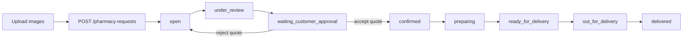

# Pharmacy Treatment Requests

All six routes require a Patient Mobile token.

## Create and list

`POST /mobile/pharmacy-requests` accepts `child_id?`, up to five `prescription_images`, nullable `treatment_details` (max 3000), `delivery_address`, `delivery_phone`, nullable `notes` (max 2000), and `preferred_payment_method` (`cash_on_delivery|card`). At least one completed prescription image or non-empty treatment details is required.

```json
{"child_id":null,"prescription_images":["550e8400-e29b-41d4-a716-446655440001"],"treatment_details":"دواء الضغط حسب الوصفة","delivery_address":{"address_text":"بغداد - الكرادة","lat":33.3024,"lng":44.4090},"delivery_phone":"07711111111","notes":"الاتصال قبل التوصيل","preferred_payment_method":"cash_on_delivery"}
```

Prescription entries are private completed upload `assetId/reference` UUIDs with purpose `PRESCRIPTION_IMAGE`, not arbitrary URLs. The server validates ownership/readiness and attaches them to the created request.



`GET /pharmacy-requests` supports `page`, `limit` max 100, and status. Detail is `GET /:id`. Patient DTO includes beneficiary, private prescription references, details/address/phone/notes/payment method, `status`, `workflowVersion`, nullable quotation and accepted quotation, nullable current pharmacy, cancellation, and timestamps. Ownership failures appear as `404`.

## Quotation and decisions

Quotation fields: `version`, `pharmacy_id`, `items[{name,quantity,unit_price,line_total,note}]`, `unavailable_items`, `medicines_subtotal`, `delivery_fee`, `discount`, `total_price`, nullable `pharmacy_note`, `quoted_at`, nullable `accepted_at`. The backend uses `line_total` and `total_price`; there is no separate `subtotal` or `currency` field in this API. Prices are integer minor/business units and current demo examples use IQD.

Accept: `PATCH /:id/accept-quote` with `{ "quotation_version": 1 }`. Reject: `PATCH /:id/reject-quote` with `{ "quotation_version": 1, "reason": "السعر غير مناسب" }`. Decisions are valid only in `waiting_customer_approval` and must match the active version. Acceptance copies an immutable authoritative `accepted_quotation`; rejection excludes that pharmacy, clears the active quotation/assignment, and reopens the request.

## States and Patient actions

| Value | Label / التسمية | Patient action |
|---|---|---|
| `open` | Open / متاح للصيدليات | cancel |
| `under_review` | Under review / قيد المراجعة | cancel |
| `waiting_customer_approval` | Approval required / بانتظار موافقة العميل | accept, reject, cancel |
| `confirmed` | Confirmed / مؤكد | none |
| `preparing` | Preparing / قيد التجهيز | none |
| `ready_for_delivery` | Ready for delivery / جاهز للتوصيل | none |
| `out_for_delivery` | Out for delivery / في الطريق | none |
| `delivered` | Delivered / تم التسليم | none |
| `cancelled` | Cancelled / ملغى | none; admin may reopen |
| `rejected` | Rejected / مرفوض | none; admin may reopen |

Patient cancel is exposed for `open`, `under_review`, and `waiting_customer_approval`; later states conflict. The current backend may return historical/reopened requests as `open` again.

Meaningful codes: `INVALID_IDENTIFIER`, `INVALID_INPUT`, `INVALID_PRESCRIPTION_IMAGES`, `TREATMENT_CONTENT_REQUIRED`, `CHILD_NOT_ACTIVE`, `INVALID_DELIVERY_ADDRESS`, `PHARMACY_REQUEST_NOT_FOUND`, `QUOTATION_NOT_ACTIVE`, `STALE_QUOTATION_VERSION`, `STALE_WORKFLOW_VERSION`, `INVALID_STATE_TRANSITION`, `UPLOAD_NOT_READY`, `UPLOAD_PURPOSE_MISMATCH`, `UPLOAD_TARGET_NOT_OWNED`.

Arabic: عند `STALE_QUOTATION_VERSION` أعد جلب التفاصيل واعرض السعر الجديد، ولا توافق تلقائياً على نسخة مختلفة.

