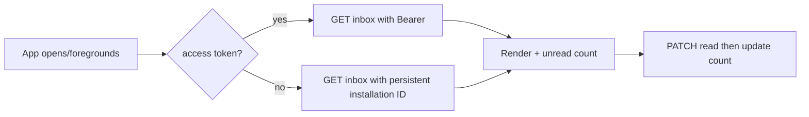

# Notifications

All four routes use optional authentication:

| Method/path | Guest | Authenticated Patient |
|---|---|---|
| `GET /notifications` | PUBLIC, installation ID required | PUBLIC + own TARGETED |
| `GET /notifications/unread-count` | PUBLIC count | all visible count |
| `PATCH /notifications/:id/read` | PUBLIC receipt, rate-limited | own visible receipt |
| `PATCH /notifications/read-all` | all visible PUBLIC receipts, rate-limited | all visible receipts |

No `Authorization` header means guest. Any presented credential is validated; invalid/expired/revoked/wrong-audience credentials return `401`/`403` and do not silently downgrade.

Guests must send a persistent UUID v4, for example `X-Installation-Id: 550e8400-e29b-41d4-a716-446655440000`. Generate once per installation and retain it. Logged-in User identity takes precedence, so installation ID is ignored. Guest write rate limit is 30/minute per installation+IP; reads are covered by the global API limit (100/minute).

```bash
curl '{{baseUrl}}/mobile/notifications?page=1&limit=20&category=all' -H 'X-Installation-Id: 550e8400-e29b-41d4-a716-446655440000'
```

```json
{"error":false,"message":"تم جلب الإشعارات بنجاح","data":[{"_id":"66f000000000000000000080","category":"appointments","type":"appointment_confirmed","title":"تم تأكيد الموعد","body":"تم تأكيد موعدك التجريبي","target":{"type":"appointment","id":"66f000000000000000000070"},"privacy":"normal","createdAt":"2026-09-05T08:00:00.000Z","is_read":false,"read_at":null}],"pagination":{"page":1,"limit":20,"total":1,"pages":1,"hasNext":false,"hasPrev":false},"unread_count":1}
```

Pagination is page-based (limit max 50), ordered by `createdAt` and `_id` descending. Categories are `appointments`, `medications`, `results`, `services`, `account`, and `system`; `all` is only a query/UI concept. No current domain producer writes `results`, although admin-created content may use that category.

Read state is viewer-specific and computed from read receipts; never trust legacy `Notification.is_read`. Mark-one is idempotent and returns the new unread count; invisible/other-user IDs return `404`. Mark-all returns `marked_count` and `unread_count`.

## Type catalog

| Type | Category/source | Meaning / potential action |
|---|---|---|
| `appointment_booked` | appointments/appointment | request created; open Appointment |
| `appointment_confirmed` | appointments/appointment | confirmed; open Appointment |
| `appointment_cancelled` | appointments/appointment | cancelled; open Appointment |
| `appointment_reminder` | appointments/appointment | upcoming reminder; open Appointment |
| `appointment_completed` | appointments/appointment | completed; open Appointment |
| `appointment_no_show` | appointments/appointment | no-show; open Appointment |
| `appointment_rescheduled` | appointments/appointment | replacement created; open Appointment |
| `general` | admin-selected | informational; target may be null |
| `home_care_confirmed`, `home_care_assigned`, `home_care_on_the_way`, `home_care_arrived`, `home_care_in_progress`, `home_care_completed`, `home_care_cancelled`, `home_care_rejected` | services/home_care_request | open Home Care request |
| `pharmacy_under_review`, `pharmacy_quotation_ready`, `pharmacy_quotation_declined`, `pharmacy_confirmed`, `pharmacy_preparing`, `pharmacy_ready_for_delivery`, `pharmacy_out_for_delivery`, `pharmacy_delivered`, `pharmacy_cancelled`, `pharmacy_rejected`, `pharmacy_reopened` | medications/pharmacy_treatment_request | open Pharmacy request |

Targets are semantic, not frontend routes:

```dart
switch (notification.target?.type) {
  case 'appointment': openAppointment(notification.target!.id); break;
  case 'home_care_request': openHomeCareRequest(notification.target!.id); break;
  case 'pharmacy_treatment_request': openPharmacyRequest(notification.target!.id); break;
}
```

Inbox may contain the full allowed title/body. For `privacy: "sensitive"`, push delivery uses generic title `Cannula` and body `لديك إشعار جديد`; never assume push text equals inbox text. Group Today/Yesterday/Previous locally using Baghdad time.



Arabic: `all` ليست قيمة مخزنة، وحالة القراءة تخص المستخدم أو تثبيت الجهاز الحالي فقط.

