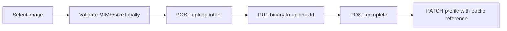

# Uploads and Images

The three shared routes are mounted under `/api/mobile/upload` and require a Patient Mobile token.

## Supported Patient purposes

| Purpose | `targetId` | Max | Visibility | Domain field |
|---|---|---:|---|---|
| `PATIENT_PROFILE_PHOTO` | Patient profile `_id` | 5 MiB | PUBLIC | profile `profile_photo` |
| `PATIENT_CHILD_PHOTO` | owned child `_id` | 5 MiB | PUBLIC | child `photo` |
| `PRESCRIPTION_IMAGE` | Patient profile `_id` | 8 MiB | PRIVATE | Pharmacy `prescription_images[]` |

The enum contains dashboard purposes too, but a Patient Mobile token receives `403 UPLOAD_PURPOSE_FORBIDDEN` for them. Allowed MIME values are exactly `image/jpeg`, `image/png`, and `image/webp`. The configured global R2 cap may lower the purpose cap. At most five pending/validating assets exist per user; intent creation is additionally limited to 10/minute/user.

## Four-step flow

1. `POST /mobile/upload/intents` with `{purpose,targetId,contentType}`.
2. PUT raw bytes directly to `uploadUrl` with exactly matching `Content-Type`. Do not send the API bearer token to storage.
3. `POST /mobile/upload/intents/:uploadId/complete`.
4. Submit returned `reference` to the domain endpoint.

```bash
curl -X POST '{{baseUrl}}/mobile/upload/intents' -H 'Authorization: Bearer {{accessToken}}' -H 'Content-Type: application/json' -d '{"purpose":"PATIENT_PROFILE_PHOTO","targetId":"{{patientId}}","contentType":"image/jpeg"}'
```

Intent data is `{uploadId,uploadUrl,expiresAt,expectedContentType,maxUploadBytes}`. Presigned PUT lifetime defaults to 600 seconds and is bounded to 300..900 seconds by configuration.

```bash
curl -X PUT '<uploadUrl>' -H 'Content-Type: image/jpeg' --data-binary '@photo.jpg'
curl -X POST '{{baseUrl}}/mobile/upload/intents/<uploadId>/complete' -H 'Authorization: Bearer {{accessToken}}'
```

Public completion:

```json
{"error":false,"message":"تم التحقق من الملف بنجاح","data":{"assetId":"uuid","purpose":"PATIENT_PROFILE_PHOTO","contentType":"image/jpeg","size":123456,"visibility":"PUBLIC","url":"https://cdn.example.com/public/...jpg","reference":"https://cdn.example.com/public/...jpg"}}
```

Private completion has `url: null` and `reference` equal to the asset UUID. Use `GET /mobile/upload/assets/:uploadId/access` when an authorized viewer needs a five-minute private signed GET; its data is `{downloadUrl,expiresIn:300}`. Public assets instead return `{url,expiresIn:null}` from this access endpoint.

The server checks authoritative object MIME, byte size, and JPEG/PNG/WebP structure/dimensions (max 40 million pixels) during complete. Never render a private UUID as a URL or persist a signed GET as permanent.

## Profile photo example



Prescription flow is identical through complete, then passes the private `reference` in `prescription_images`. Child images require the child to exist first.

Codes: `UPLOAD_PURPOSE_FORBIDDEN`, `UPLOAD_CONTENT_TYPE_UNSUPPORTED`, `UPLOAD_TARGET_NOT_FOUND`, `UPLOAD_TARGET_NOT_OWNED`, `UPLOAD_RATE_LIMITED`, `UPLOAD_NOT_FOUND`, `UPLOAD_EXPIRED`, `UPLOAD_VALIDATION_IN_PROGRESS`, `UPLOAD_ALREADY_REJECTED`, `UPLOAD_OBJECT_MISSING`, `UPLOAD_TOO_LARGE`, `UPLOAD_CONTENT_MISMATCH`, `UPLOAD_VALIDATION_FAILED`, `UPLOAD_NOT_READY`, `UPLOAD_PURPOSE_MISMATCH`, `UPLOAD_ALREADY_ATTACHED`, `STORAGE_UNAVAILABLE`.

## Image nullability

| Entity/field | Required | Nullable | Placeholder guidance |
|---|---:|---:|---|
| Doctor `profile_photo` | no | yes | avatar initials |
| Specialty `icon` | no | yes | specialty glyph |
| Clinic `icon` | no | yes | clinic glyph |
| Ad `image` | yes | no | malformed/missing URL: omit card and report telemetry |
| Home Care category `icon`,`image` | no | yes | category glyph/neutral card |
| Home Care service `image` | no | yes | neutral service image |
| Patient `profile_photo` | no | yes | initials |
| Child `photo` | no | yes | age-neutral avatar |
| Assigned nurse `profile_photo` | no | yes | initials |
| Current pharmacy `logo` | no | yes | pharmacy glyph |

Arabic: صور الوصفات خاصة؛ استخدم رابط الوصول المؤقت فقط ولا تسجل الرابط أو تشاركه.

