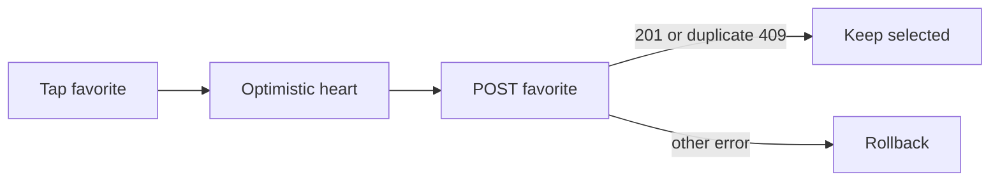

# Doctor Favorites

All routes require a Patient Mobile token.

- `GET /mobile/doctor-favorites?page=1&limit=10` returns favorite records containing `_id`, `doctor_id`, `createdAt`, and public Doctor summary, ordered with the same Doctor presentation ordering (limit max 100).
- `POST /mobile/doctor-favorites` accepts `{ "doctor_id": "{{doctorId}}" }`, returns `201`.
- `DELETE /mobile/doctor-favorites/:doctor_id` removes by Doctor ID and returns `200`.

```bash
curl -X POST '{{baseUrl}}/mobile/doctor-favorites' -H 'Authorization: Bearer {{accessToken}}' -H 'Content-Type: application/json' -d '{"doctor_id":"{{doctorId}}"}'
```

Duplicate add returns `409`; invalid ID `400`; unavailable Doctor, missing profile, or absent favorite `404`.

Safe optimistic UI: update the heart immediately while retaining the previous state; on success reconcile with response/list, on `409` treat add as already favored, on delete `404` treat as already removed, and roll back other failures.



Arabic: القائمة الفارغة نجاح طبيعي وليست خطأ؛ اعرض دعوة لاستكشاف الأطباء.

